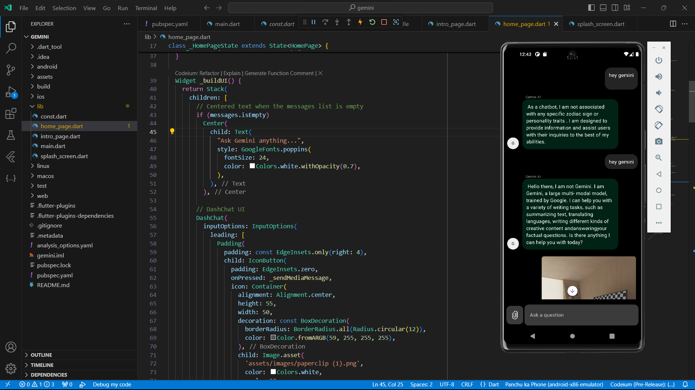
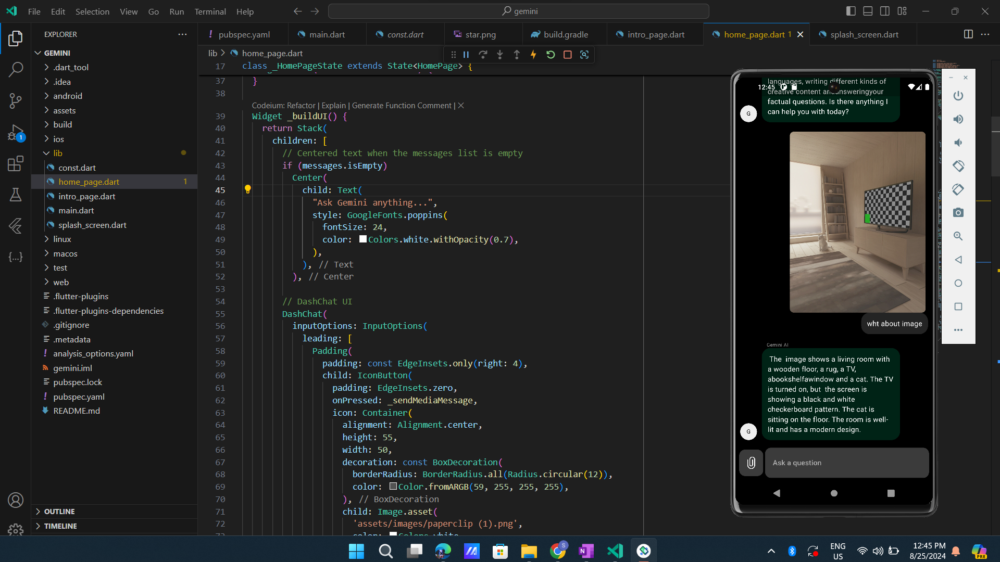

# Gemini AI Flutter App

This Flutter application integrates the Gemini AI API to create an interactive chat interface with image analysis capabilities. It's designed as a learning project to explore the integration of AI in mobile applications.

## 📱 Screenshots

## 🚀 Features

- Text-based chat with Gemini AI
- Image analysis and description
- Intuitive user interface
- Asynchronous API integration

## 🛠️ Getting Started

### Prerequisites

- Flutter SDK
- Dart SDK
- Gemini AI API key

### Installation

1. Clone the repository:
